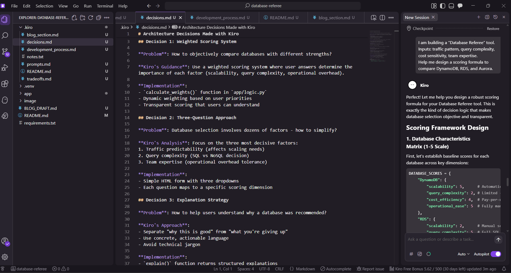

# Kiro Documentation for Database Referee

This folder contains evidence of how Kiro was used as a reasoning partner to design the Database Referee's decision logic and explanations.

## Files Overview

- **`prompts.md`** - Actual conversations with Kiro that shaped the tool
- **`decisions.md`** - Architecture decisions made with Kiro's guidance  
- **`tradeoffs.md`** - Database trade-off analysis developed with Kiro
- **`blog_section.md`** - Ready-to-use blog content explaining Kiro's role
- **`notes.txt`** - Additional project notes

## Key Evidence Points

✅ **Kiro used for complete development** - Design, implementation, and user experience  
✅ **Kiro used for decision logic** - Weighted scoring framework  
✅ **Kiro used for trade-off analysis** - Honest, beginner-friendly explanations  
✅ **Kiro used for architecture decisions** - Three-question approach and FastAPI structure  
✅ **Code built with Kiro guidance** - Every component developed collaboratively

## For Judges

This documentation demonstrates that **Kiro was the complete development partner for the Database Referee tool** - from conceptual design through implementation and user experience.

The decision logic, scoring framework, user explanations, and technical implementation all emerged from collaborative development with Kiro.