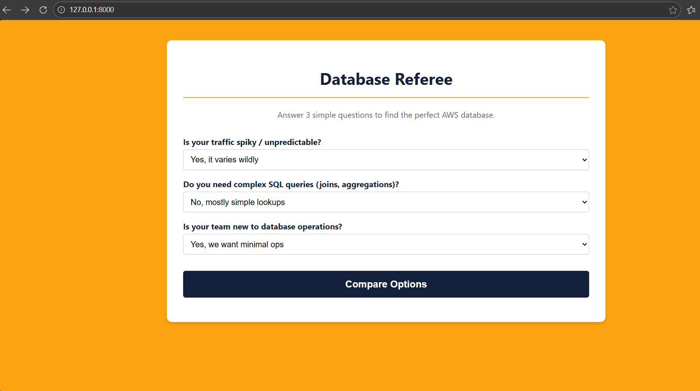
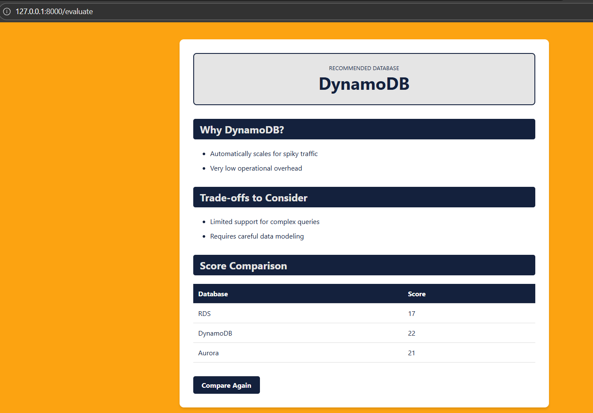

# Database Referee

> **Built completely with [Kiro](https://kiro.ai)** 🚀


A FastAPI application that recommends the right AWS database (RDS, DynamoDB, or Aurora) based on three simple questions, with transparent scoring and honest trade-off explanations.

**Every aspect developed collaboratively with Kiro** - from conceptual design through implementation and user experience.

## Screenshots

| Input Form | Results Page |
| :---: | :---: |
|  |  |

## Quickstart

1. Install dependencies:

```
pip install -r requirements.txt
```

2. Run the API:

```
uvicorn app.main:app --reload
```

3. Open the form in your browser:

```
http://127.0.0.1:8000
```

Submit your answers and the API returns the recommendation plus the reasoning.

## How Kiro Built This

This project demonstrates **complete collaborative development with Kiro**:

- **🧠 Conceptual Design**: Kiro identified the three key decision factors and weighted scoring approach
- **🏗️ Technical Architecture**: Kiro guided the clean FastAPI structure and separation of concerns  
- **🎨 User Experience**: Kiro designed the approachable language and visual hierarchy
- **⚙️ Implementation**: Every component built through Kiro collaboration
- **🛡️ Robustness**: Kiro validated edge cases and error handling

**See `.kiro/` folder for complete development documentation and conversations.**

## Project layout

- `app/data.py` — database scoring matrix (developed with Kiro)
- `app/logic.py` — weighted scoring algorithm (Kiro-designed)
- `app/explanations.py` — user-friendly trade-offs (Kiro-crafted)
- `app/main.py` — FastAPI routes and HTML (Kiro-guided)
- `requirements.txt` — Python dependencies
- `.kiro/` — complete development documentation and Kiro conversations
